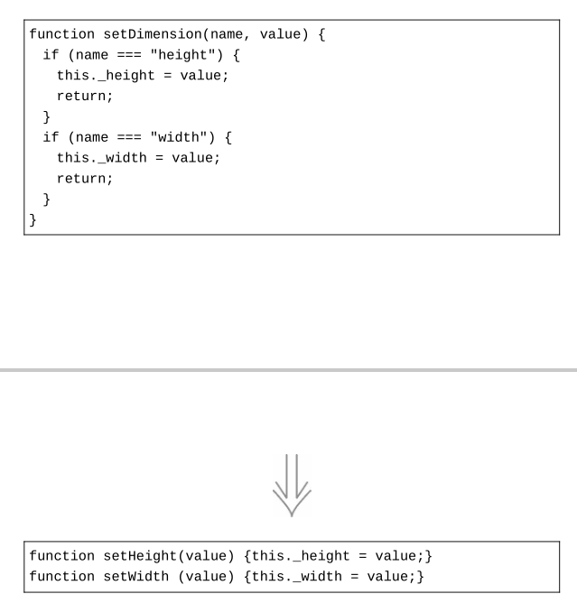

# reconsitution
重构：改善既有代码的设计（第2版）总结

## 第一章 重构，第一个示例
### 1.2
如果你要给程序添加一个特性，但发现代码因缺乏良好的结构而不易于进行更改，那就先重构那个程序，使其比较容易添加该特性，然后再添加该特性
### 1.3
**重构前需要先一套测试用例，来检测重构的代码与重构后运行的结果是否一致，来检测重构是否有bug产生**
### 1.6
拆分阶段（154）:将逻辑分成两部分：一部分计算详单所需的数据，另一部分将数据渲染成 文本或HTML  
第一阶段会创建一个中转数据结构，再把它传递给第二阶段。  
总的来说： 过去在**印详单里调用相关的逻辑数据计算直接呈现出来**,  
先进行计算出来将处理后的数据封装到实体类， 后通过调用文本或HTML方法呈现出来（将数据 与视图呈现分开）
### 1.7
增加了HTML视图模式，现有两种数据呈现方式，纯文本和HTML
### 1.8与1.9
创建个PerformanceCalculator数据结构进行以多态的形式调用封装

### 1.10
好代码的检验标准就是人们是否能轻而易举地修改它。好代码应该直截了当：有人需要修改代码时，他们应能轻易找到修改点，应该能快速做出更改，而不易引入其他错误

## 第二章 重构的原则
###2.1何谓重构  
1. 重构（名词）：对软件内部结构的一种调整，目的是在不改变软件可观察行为的前提下，提高其可理解性，降低其修改成本  
2. 重构（动词）：使用一系列重构手法，在不改变软件可观察行为的前提下，调整其结构。  
3. 重构的关键在于运用大量微小且保持软件行为的步骤，一步步达成大规模的修改。每个单独的重构要么很小，要么由若干小步骤组合而成。因此，在重构的过程中，
我的代码很少进入不可工作的状态，即便重构没有完成，我也可以在任何时刻停下来。  
4. 如果有人说他们的代码在重构过程中有 一两天时间不可用，基本上可以确定，他们在做的事不是重构。  
5. 重构与性能优化两者的差别在于其目的：重构是为了让代码“更容易理解，更易于修改”。这可能使程序运行得更快，也可能使程序运行得更慢。在性能优化时，我只关心让程序运行得更快，最终得到的代码有可能更难理解和维护，对此我有心理准备。
###2.3为何重构
我不想把重构说成是包治百病的万灵丹，它绝对不是所谓的“银弹”。不过它的确很有价值，尽管
它不是一颗“银弹”，却可以算是一把“银钳子”，**可以帮你始终良好地控制自己的代码**。
设计欠佳的程序往往需要更多代码，这常常是因为代码在不同的地方使用完全相同的语句做同样的事,消除重复代码，方法复用  
###2.4何时重构
1. 事不过三，三则重构 第一次做某件事时只管去做；第二次做类似的事会产生反感，但无论如何还是可以去做；第三次再做类似的事，你就应该重构  
2. 重构的最佳时机就在添加新功能之前,修改过去的参数结构，而不是整个函数复制过来，修改这几个值  
3. 如果一块代码我很少触碰，它不会经常给我带来麻烦，那么我就倾向于不去重构它  
4. 花在重构的时间是在拖慢新功能的开发进度。“重构会拖慢进度”这种看法仍然很普遍，这可能是导致人们没有充分重构的最大阻力所在
我们之所以重构，因为它能让我们更快——添加功能更快，修复bug更快。一定要随时记住这一点，与别人交流
时也要不断强调这一点。重构应该总是由经济利益驱动。程序员、经理和客户越理解这一点，“好的设计”那条曲线就会越经常出现。  
**复用一个逻辑方法，但传参不对，可以增加修改此方法入参，而不是复制此方法，重新创造一个方法**
###2.8重构与性能
在性能优化阶段，我首先应该用一个度量工具来监控程序的运行，让它告诉我程序中哪些地方大量消耗时间和空间。这样我就可以找出性能热点所在的一小段代码。
然后我应该集中关注这些性能热点，并使用持续关注法中的优化手段来优化它们。 由于把注意力都集中在热点上，较少的工作量便可显现较好的成果  
1. 时间预算法，这通常只用于性能要求极高的实时系统。如果使用这种方法，分解你的设计时就要做好预算，给每个组件预先分配一定资源，包括时劳而无获间和空间占用。每个组件绝对不能超出自己的预算  
2. 持续关注法。这种方法要求任何程序员在任何时间做任何事时，都要设法保持系统的高性能。  
3. 统计数据,只关注性能差的一小半代码，进行性能优化  

##第三章 代码的坏味道
1. 神秘命名（不能表达含义）  
2. 重复代码  
3. 过长函数  
每当感觉需要以注释来说明点什么的时候，我们就把需要说明的东西写进一个独立函数中，并以其用途（而非实现手法）命名。  
我们可以对一组甚至短短一行代码做这件事。哪怕替换后的函数调用动作比函数自身还长，只要函数名称能够解释其用途，我们也该毫不犹豫地那么
做。关键不在于函数的长度，而在于函数“做什么”和“如何做”之间的语义距离  
4. 过长参数列表  
某个参数发起查询而获得另一个参数的值，那么就可以使用以查询取代参数（324）去掉这第二个参数  参数过多可以弄个数据结构封装表示  
5. 全局数据  
全局数据的问题在于，从代码库的任何一个角落都可以修改它，而且没有任何机制可以探测出到底哪段代码做
出了修改。一次又一次，全局数据造成了那些诡异的bug  
全局数据最显而易见的形式就是全局变量，但类变量和单例各个地方都可以调用修改  
可以将全局数据（全局static静态变量）设置为private,在用方法封装，其他需要调用方法才能修改  
6. 可变数据  
封装变量，用几个方法封装，后续只操作方法，如果一个变量在不同时候被用于存储不同
的东西，可以使用拆分变量（240）将其拆分为各自不同用途的变量  
7. 发散式变化  
如果新加入一个数据库，我必须修改这3个函数；如果新出现一种金融工具，我必须修改这4个函数。
”这就是发散式变化的征兆。数据库交互和金融逻辑处理是两个不同的上下文，将它们分别搬移到各自独立的模块中， 
能让程序变得更好：每当要对某个上下文做修改时，我们只需要理解这个上下文弄个数据结构再多封装一层  
8. 霰弹式修改  
如果每遇到某种变化，你都必须在许多不同的类内做出许多小修改，将所有需要修改的代码放进同一个模块里  
9. 依恋情结  
一个函数跟另一个模块中的函数或者数据交流格外频繁，远胜于在自己所处模块内部的交流，这就是依恋情结的典型情况  
一个函数往往会用到几个模块的功能，那么它究竟该被置于何处呢？我们的原则是：判断哪个模块拥有的此函数
使用的数据最多，然后就把这个函数和那些数据摆在一起。      
10. 数据泥团  
你常常可以在很多地方看到相同的三四项数据变量，将这三四项数据变量提炼到javabean中，并引用Javabean做对象参数  
11. 基本类型偏执  
钱、坐标、范围等。于是，我们看到了把钱当作普通数字来计算的情况、计算物理量时无视单位（如把英寸与毫米相加）的情况  
比如电话号码不只是字符串，用对象取代基本类型  
12. 重复的switch  
在不同的地方反复使用同样的switch逻辑  
重复的switch的问题在于：每当你想增加一个选择分支时，必须找到所有的switch,并逐一更新。多态给了我们对抗这种黑暗力量的武器  
13. 循环语句  
用stream操作 函数式编程  
14. 冗赘的元素  
15. 夸夸其谈通用性 可以移除代码了  
16. 临时字段  
减少临时字段的产生  
17. 过长的消息链  
客户端代码一个方法里请求多个方法，在实际代码中你看到的可能是一长串取值函数
比如controller层请求多个方法，那么这些方法可以放到service里  
18. 中间人  
某个类的接口有一半的函数都委托给其他类，那么可以把此类的接口方法放到其他类里  
19. 内幕交易  
软件开发者喜欢在模块之间建起高墙，极其反感在模块之间大量交换数据，因为这会增加模块间
的耦合。在实际情况里，一定的数据交换不可避免，但我们必须尽量减少这种情况，并把这种交换
都放到明面上来。 通过一个数据结构来维护传递数据交互。  
20. 过大的类  
与方法一样，拆分成多个类  
21. 异曲同工的类  
今天用这个类，未来可以换成用另一个类。但只有当两个类的接口一致时，才能做这种替换  
22. 纯数据类  
将get set 方法放到纯数据字段类里  
23. 被拒绝的遗赠  
抽象类就只持有所有子类共享的东西，不愿意支持抽象类的抽象方法，可以将继承变为依赖
    
##第六章第一组重构
1. 提炼函数  
创造一个新函数，根据这个函数的意图来对它命名（以它“做什么”来命名，而不是以它“怎样做”命名）  
如果你需要花时间浏览一段代码才能弄清它到底在干什么，那么就应该将其提炼到一个函数中，并根据它所做的事为其命名  
2. 内联函数  
反向重构：提炼函数

>1.某些函数，其内部代码和函数名称同样清晰易读,你就应该去掉这个函数，直接使用其中的代码  
>2.手上有一群组织不甚合理的函数。可以将它们都内联到一个大型函数中，再以我喜欢的方式重新提炼出小函数。  

3. 提炼变量  
引入解释性变量  
反向重构：内联变量（123）

4. 内联变量  
反向重构：提炼变量

5. 改变函数声明  
函数改名、添加移除参数  

6. 封装变量  
一个对象字段，通过get set方法进行封装

7. 变量改名

8. 引入参数对象  
将多个字段组成一个Javabean类

9. 函数组合成类  
如果有多个方法入参都是一个数据结构，可以把数据结构与这些方法创建一个类放进去，这些方法就可以直接用类里面的数据结构

10. 函数组合成变换

如果代码中会对源数据[传入的数据结构中的参数]做更新，那么使用类要好得多；如果使用变换，派生数据会被存储在新生
成的记录中，一旦源数据[传入的数据结构中的参数]被修改，我就会遭遇数据与不一致[传入的数据结构中的参数]计算不一致  

11. 拆分阶段

每当看见一段代码在同时处理两件不同的事，我就想把它拆分成各自独立的方法  

##第七章封装
1. 封装记录（将数据变成一个Javabean)  
2. 封装集合  
3. 以对象取代基本类型  
一开始你可能会用一个字符串来表示“电话号码”的概念，但是随后它又需要“格式化”“抽取区号”之类的特殊行为
4. 以查询取代临时变量
  

**初始化 :**

**变量basePrice 转换成方法**

**变量discountFactor 转换成方法**

5. 提炼类  
反向重构：内联类  
提炼类，把相似作用的变量和方法放在一个新类里，旧类直接引用新类
  
6. 内联类  
反向重构：提炼类  
如果一个类不再承担足够责任，不再有单独存在的理由  
另一个场景是，我手头有两个类，想重新安排它们肩负的职责，并让它们产生关联。这时我发现先用本手法将它们内联成一个类再
用提炼类（182）去分离其职责会更加简单。这是重新组织代码时常用的做法：有时把相关元素一口气搬移到位更简单，但有时先用内联手法合并各自
的上下文，再使用提炼手法再次分离它们会更合适。
7. 隐藏委托关系*  
反向重构：移除中间人

manager = aPerson.department.manager; 客户知道： department负责追踪“经理”这条信息。    
如果对客户隐藏Department ，可以减少耦合。为了这一目的，我在Person中建立一个简单的委托函数。
> **封装”意味着每个模块都应该尽可能少了解系统的其他部分。如此一来，一旦发生变化，需要了解这一变化的模块就
会比较少——这会使变化比较容易进行**
>
8. 移除中间人  
反向重构：隐藏委托关系  
每当客户端要使用受托类的新特性时，你就必须在服务端添加一个简单委托函数。随着受托类的特性（功能）越来越多，
更多的转发函数就会使人烦躁。服务类完全变成了一个中间人，此时就应该让客户直接调用受托类

##第八章搬移特性
1. 搬移函数  
将一个方法搬移到另外一个类里
频繁引用其他类上下文中的元素，而对自身上下文中的元素却关心甚少。此时让它去与那些更亲密的元素相会  
2. 搬移字段  
当调用某个函数时，除了传入一个对象参数，还总是需要同时传入另一条对象的某个字段一起作为参
数。总是一同出现、一同作为函数参数传递的数据，最好是规整到同一条对象中  
3. 搬移语句到函数  
如果我发现调用某个函数时，总有一些相同的代码也需要每次执行，那么我会考虑将此段代码合并到函数里
头。这样，日后对这段代码的修改只需改一处地方，还能对所有调用者同时生效。如果将来代码对
不同的调用者需有不同的行为，那时再通过搬移语句到调用者（217）将它（或其一部分）搬移出来也十分简单。  
4. 搬移语句到调用者  
反向重构：搬移语句到函数  
以往在多个地方共用的方法，如今需要在某些调用点面前表现出不同的行为。于是，我们得把表现不同的行为从
函数里挪出，并搬移到其调用处。  
5. 以函数调用取代内联代码  
配合一些库函数使用，会使手法效果更佳，因为我甚至连函数体都不需要自己编写，库已经提供了相应的函数  
6. 移动语句  

如果有几行代码取用了同一个数据结构， 那么最好是让它们在一起出现，而不是夹杂在取用
其他数据结构的代码中间
7. 拆分循环  
  
一次循环只做一件事情（看情况吧）
8. 以管道取代循环  
尽量用函数式编程
9. 移除死代码  
移除没用的代码

##第9章　重新组织数据（数据结构）
1. 拆分变量

2. 字段改名
3. 以查询取代派生变量   
尽量把可变数据的作用域限制在最小范围
4. 将引用对象改为值对象  5. 将值对象改为引用对象  
两者最明显的差异在于如何更新内部对象的属性：  
如果将内部对象视为引用对象，在更新其属性时，我会保留原对象不动，更新内部对象的属性；  
如果将其视为值对象，我就会替换整个内部对象，新换上的对象会有我想要的属性值。  
如果我想在几个对象之间共享一个对象，以便几个对象都能看见对共享对象的修改，那么这个共享的对象就应该是引用

##第10章　简化条件逻辑
1. 分解条件表达式  
封装成各个方法

2. 合并条件表达式  

3. 以卫语句取代嵌套条件表达式  

4. 以多态取代条件表达式  

5. 引入Null对象  
用hutool等库方法判断是否为null 是否为‘’  
6. 引入断言

##第11章　重构API
有些参数其实只是一个标记，根据这个标记 的不同，函数会有截然不同的行为，此时最好用移除标记参数（314）将不同的行为彻底分开
1.将查询函数和修改函数分离
2.函数参数化
发现两个函数逻辑非常相似，只有一些字面量值不同，可以将其合并成一个函数，以参数
的形式传入不同的值，从而消除重复

3.移除标记参数

如果 调用者传入的是程序中流动的数据，这样的参数不 算标记参数；只有调用者直接传入字面量值，这才
是标记参数。另外，在函数实现内部，如果参数值只是作为数据传给其他函数，这就不是标记参数；
只有参数值影响了函数内部的控制流，这才是标记参数。
4.保持对象完整

如果我看见代码从一个记录结构中导出几个值，然后又把这几个值一起传递给一个函数，我会
更愿意把整个记录传给这个函数，在函数体内部导出所需的值
5.以查询取代参数
反向重构：以参数取代查询
放到函数内部计算

6.以参数取代查询
引用一个全局变量，或者引用另一个我想要移除的元素。为了解决这些令人不
快的引用，我需要将其替换为函数参数，从而将处理引用关系的责任转交给**函数的调用者**。

需要使用本重构的情况大多源于我想要改变代码的依赖关系——为了让目标函数不再依赖于某个
元素，我把这个元素的值以参数形式传递给该函数。
7.移除设值函数
8.以工厂函数取代构造函数
用自定义函数 封装构造函数调用

9.以命令取代函数
反向重构：以函数取代命令
命令：将函数封装成自己的对象
做法：
1.为想要包装的函数创建一个空的类，根据该函数的名字为其命名。
2.使用搬移函数（198）把函数移到空的类里。
3.遵循编程语言的命名规范来给命令对象起名。如果没有合适的命名规范，就给命令对象中负责实
际执行命令的函数起一个通用的名字，例如“ execute ”或者“ call ”。
4.可以考虑给每个参数创建一个字段，并在构造函数中添加对应的参数。

改变成为

10.以函数取代命令
反向重构：以命令取代函数

命令对象为处理复杂计算提供了强大的机制。借助命令对象，可以轻松地将原本复杂的函数拆解
为多个方法，彼此之间通过字段共享状态；拆解后的方法可以分别调用；开始调用之前的数据状态也
可以逐步构建。但这种强大是有代价的。大多数时候，我只是想调用一个函数，让它完成自己的工作
就好。如果这个函数不是太复杂，那么命令对象可能显得费而不惠，我就应该考虑将其变回普通的函数。

##第12章 处理继承关系
1.函数上移
反向重构：函数下移

2.字段上移
反向重构：字段下移

如果各子类是分别开发的，或者是在重构过程中组合起来的，你常会发现它们拥有重复特性，特
别是字段更容易重复。这样的字段有时拥有近似的名字，但也并非绝对如此。判断若干字段是否重
复，唯一的办法就是观察函数如何使用它们。如果**它们被使用的方式很相似，我就可以将它们提升到超类中去**
3.构造函数本体上移

4.函数下移
如果超类中的某个函数只与一个（或少数几个）子类有关，那么最好将其从超类中挪走，放到
真正关心它的子类中去
5.字段下移
如果某个字段只被一个子类（或者一小部分子类）用到，就将其搬移到需要该字段的子类中
6.以子类取代类型码
反向重构：移除子类

用子类代替type字段
7.移除子类
反向重构：以子类取代类型码

子类很有用，它们为数据结构的多样和行为的多态提供支持
子类存在着就有成本，阅读者要花心思去理解 它的用意，所以如果子类的用处太少，就不值得存
在了。此时，最好的选择就是移除子类，将其替换 为超类中的一个字段。
8.提炼超类
子类相同方法放到超类里
9.折叠继承体系

在重构类继承体系时，我经常把函数和字段上下移动。随着继承体系的演化，我有时会发现一个
类与其超类已经没多大差别，不值得再作为独立的类存在。此时我就会把超类和子类合并起来
选择想移除的类：是超类还是子类？
我选择的依据是看哪个类的名字放在未来更有意义
10.以委托取代子类，以委托取代超类

组合取代继承

工作我缺少的重构：
7. 发散式变化  
   如果新加入一个数据库，我必须修改这3个函数；如果新出现一种金融工具，我必须修改这4个函数。
   ”这就是发散式变化的征兆。数据库交互和金融逻辑处理是两个不同的上下文，将它们分别搬移到各自独立的模块中，
   能让程序变得更好：每当要对某个上下文做修改时，我们只需要理解这个上下文弄个数据结构再多封装一层  

